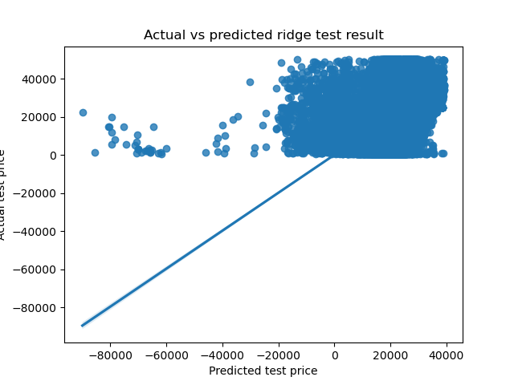

## Used Car PRediction

Predict the prices of used cars to help car dealers sell and market better. This is the solution
for practical assignment 11.1 (BHPCMLAI)

### Summary of findings

We have applied CRISP-DM to come up with a working model for the problem. The findings are as follows:

- We could predict price of car with r2 score of 0.35 using Linear Regression.
- The top features which guides the price are year of the model, transmission type and car type.

For more details, please check the notebook at [Used_car_prediction](https://github.com/parthoghosh24/used_car_prediction/blob/main/used_car_prediction.ipynb)

### Project structure

- <b><u>data</u></b>: Contains the actual data
- <b><u>images</u></b>: Contains images related to project
- <b><u>README</u></b>: This file
- <b><u>used_car_prediction.ipynb</u></b>: [Jupyter Notebook](https://github.com/parthoghosh24/used_car_prediction/blob/main/used_car_prediction.ipynb) for the project
